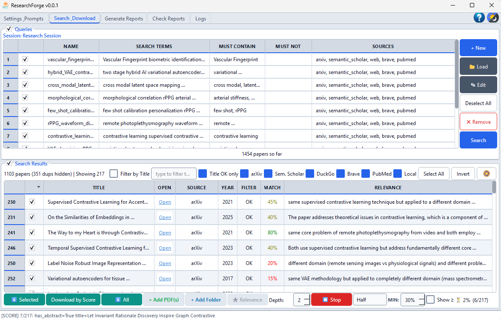
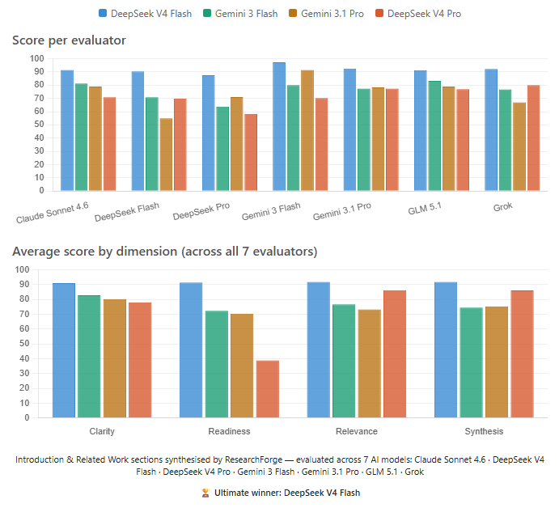

# ResearchForge

<p align="center">
  
</p>

Desktop application that searches academic paper databases, downloads PDFs, and uses a local/remote LLM to analyze, summarize, and synthesize research findings.

**New — MCP integration:** Drive the full pipeline from your AI coding assistant (opencode, Claude Code) without opening the GUI. Search, download, analyze, synthesize, and audit papers via natural language. See [MCP Integration](#-mcp-integration) below.

---

## Features

- **Multi-source search**: arXiv, OpenAlex, Crossref, Europe PMC, PubMed, Semantic Scholar, CORE, Brave, DuckDuckGo — nine providers, most needing no API key
- **Patent search**: EPO OPS (worldwide, live-verified), PatentsView (US) and PQAI (semantic prior-art) *(both untested against a live API)* — patents are analysed as patents (problem / solution / what is claimed / assignee), downloaded with their original document PDF and metadata, and synthesised into a standalone **Patent Landscape** report
- **Session creator**: AI-enhanced research description with automatic query generation and "Analyze My Paper" mode
- **Local PDF injection**: add your own PDFs or entire folders; they auto-participate in relevance scoring and download workflows
- **Relevance scoring**: LLM rates each paper 0–100 against your research context, with keyword-based fallback
- **Automated PDF download**: batch download with duplicate detection and file validation
- **Summarization pipeline**: per-paper analysis, topic synthesis, global synthesis, related work section, introduction draft
- **Audit My Paper**: 10-dimension IEEE pre-submission self-audit on any PDF or LaTeX source — score panel, questions for the author, section-by-section mode; save/load standalone audit reports, independent of any session
- **12 editable prompts**: customize every stage of the LLM pipeline. Save your edits as your **default** or as named **presets** you load on demand; **Reset to Default** (one prompt or all) restores the bundled originals, which are never overwritten. Unsaved edits are flagged and guarded on exit.
- **Analysis lenses**: filter by similarity, novelty, methodology, research gaps
- **Session management**: save, load, and resume research sessions
- **Local and remote LLMs**: LM Studio, Ollama (local) / DeepSeek, Gemini (remote API)
- **Cross-platform**: Windows (tested on Windows 11 x64), Linux, macOS

---

## Screenshots

<p align="center">
  
</p>

<p align="center"><em>Search & Download: query management, multi-source search, relevance scoring, PDF management</em></p>

---

## Model Benchmark

Four models were given the same research topic to produce an academic Introduction and Related Work section. Seven AI judges independently scored each output (0-100) across Clarity, Readiness, Relevance, and Quality of Synthesis:

<p align="center">
  
</p>

| Model | Average | Verdict |
|-------|:-------:|---------|
| **DeepSeek V4 Flash** | **91.8** | Unanimous winner, publication-ready, clean output, strongest synthesis |
| Gemini 3 Flash | 76.2 | Clean prose, good structure, incomplete constraint adherence |
| Gemini 3.1 Pro | 74.4 | Strong analytics, weakest factual completeness, reference issues |
| DeepSeek V4 Pro | 72.0 | Good depth but leaked internal reasoning into output (unpublishable) |

**Key finding:** DeepSeek V4 Flash produced the best research writing unanimously across all seven evaluators. For synthesis-heavy tasks, remote Flash-class models significantly outperform smaller local models. While the tool supports local LLMs via Ollama and LM Studio, models below ~8B parameters produce messy, incomplete, and irrelevant output. 2-3B parameter models are not viable for academic synthesis.

[Full cross-evaluator report](reports/cross_evaluator_comparison_report_final.md) with per-evaluator scorecards, dimension breakdowns, and consensus map.

---

## Quick Start

### Prerequisites

- Python 3.9+
- A local or remote LLM

### Install

```bash
pip install -r requirements.txt
python main.py
```

### LLM Setup

ResearchForge supports both local and remote LLM providers:

| Provider | Type | Requires |
|----------|------|----------|
| **LM Studio** | Local | Running server with loaded model |
| **Ollama** | Local | Running Ollama instance |
| **DeepSeek** | Remote | API key |
| **Gemini** | Remote | API key |

**Local setup** (LM Studio or Ollama):
1. Install [LM Studio](https://lmstudio.ai/) or [Ollama](https://ollama.ai/)
2. Load a model (recommended: 7B+ parameters)
3. Start the local server

> Small local models (<7B) can handle basic summarization but struggle with synthesis tasks: finding nuance, drawing cross-paper similarities, identifying gaps. For topic/global synthesis and related-work generation, remote models like DeepSeek V4 Flash or Gemini Flash produce significantly better results.

**Remote setup** (DeepSeek or Gemini):
1. Get an API key from [DeepSeek](https://platform.deepseek.com/) or [Google AI Studio](https://aistudio.google.com/)
2. Enter the key in Settings & Prompts, API Keys

Then in ResearchForge: Settings & Prompts, select your provider, click the refresh button to detect models.

---

## How It Works

### 1. Create a Session

Describe your research topic. The LLM enhances your description and can:
- **Generate Queries**: generate search queries from your description
- **Analyze My Paper**: upload your own PDF for structured claim extraction (methods, contributions, results, comparisons)

### 2. Search & Download

Run queries across multiple academic databases. You can also inject your own PDFs:
- **+ Add PDF(s)**: select one or more local PDF files; they appear in the results table and participate in relevance scoring
- **+ Add Folder**: import all PDFs from a folder, preserving structure as topics (depth control, split/flatten options)

Use the title filter, source filters, and LLM relevance scoring to narrow results.

### 3. Download

Download selected papers as PDFs. Duplicates are automatically detected and invalid files are skipped. Three download modes: Selected, by Score threshold, or All visible. Use **Delete** to remove the checked results from the list — prune a search and re-query without starting a new session (downloaded files are kept).

### 4. Summarize Pipeline

Run the LLM pipeline in stages:

| Stage | Output |
|-------|--------|
| Per-Paper Analysis | Detailed analysis of each PDF with citation key, evidence quality flags |
| Topic Synthesis | Coherent review per query topic, cross-paper tensions |
| Global Synthesis | Cross-topic research overview |
| Related Work | Publication-ready related work section (800–1200 words) |
| Introduction | Motivation-first introduction draft grounded in the synthesized evidence |

### 5. Audit My Paper

Upload your paper (PDF or `.tex`) and run a structured pre-submission self-audit before submitting to a journal.

**What is checked — 10 IEEE dimensions:**

| # | Dimension | What is evaluated |
|---|-----------|-------------------|
| 1 | Abstract | Self-contained, four subheadings, quantitative results |
| 2 | Contributions | Positive findings, falsifiable, traceable to results |
| 3 | Claims | Every claim cited or your own result, correct hedging language |
| 4 | References | Peer-reviewed venues, correct years, no duplicates |
| 5 | Transitions | Topic sentences, gap statement, forward pointers |
| 6 | Discussion | Answer-first, limitations named and scoped |
| 7 | Conclusion | Synthesizes rather than summarizes, forward-looking final sentence |
| 8 | Reproducibility | All loss coefficients, hyperparameters, derived numbers |
| 9 | Statistical Reporting | Uncertainty estimates, effect sizes, sourced population claims |
| 10 | Style | No em-dashes as separators, no internal codes, consistent notation |

**Key capabilities:**

- **Section-by-section mode** *(default)*: detects paper sections locally using font metadata and regex, audits each in a separate LLM call, synthesizes into a structured report. Works with any model size — no large context window required.
- **Single-call modes**: full paper, ~15 pages (~40k chars), or ~5 pages (~14k chars)
- **LaTeX source**: accepts `.tex` files directly — extracts abstract, bibliography, and body sections
- **Score panel**: visual `81/100` overall score + colored chip per dimension (green ≥80, amber 65–79, orange 40–64, red <40), computed from a weighted mean (Contributions ×1.5, Claims ×1.5, Reproducibility ×1.3, others ×1.0)
- **Questions for the Author**: button shows how many genuine unanswered questions the LLM found — things whose answer is absent from the paper. Click to open the list in a dialog.
- **Section inspector**: `[ inspect ]` link lets you preview the exact text of each detected section before running the audit
- **Save / Load / Unload** *(session-independent)*: **Save** writes a self-contained `.json` bundle (paper, mode, report, scores, questions) plus a readable `.md` copy to the audit folder; **Load** reopens any saved `.json` back into the tab (report, score chips, questions, paper); **Unload** clears the tab (saved files are kept). The tab isn't tied to any research session and remembers your last audit across restarts.
- **Auto-named files**: `TitleSlug_DayName_DDMonYYYY_HHMMSS`

---

## Patent Search

Patents sit alongside the academic providers as a searchable document class. Tick a
patent source on the Settings tab and its hits join your results table like any other —
but they are analysed as patents, and they produce their own report.

### Providers

| Provider | Coverage | Key | Cost | Status |
|----------|----------|-----|------|--------|
| **EPO OPS** | Worldwide bibliographic; full text mainly EP/WO | OAuth2 consumer key + secret | Free tier, 4 GB/week | ✅ **Verified against the live API** (2026-07-27) |
| **PatentsView** | US granted + pre-grant | Self-serve API key | Free | ⚠️ **Never called live** — written from documentation |
| **PQAI** | Semantic prior-art search | Token, by request | Free for academic / non-commercial | ⚠️ **Never called live** — written from documentation |

Keys go in **Set Keys** on the Settings tab. Until a key is present the source stays
greyed out, exactly like CORE and Brave.

> **Only EPO OPS has been exercised against a real API.** The other two adapters were
> written from provider documentation and have never made a live call, so their field
> names and JSON nesting are unconfirmed. Every adapter returns an empty list rather
> than raising, so a wrong field name there would look like "no results" rather than an
> error — treat an empty patent result set from PatentsView or PQAI as unproven, not as
> an answer. Verifying EPO turned up six such defects, including a query form that
> returned 1 hit where the correct one returned 925.

> **Patents are never *parsed* from a PDF — but they are downloaded.** The text used for
> analysis, including claims, arrives with the search result, so a patent analyses fully
> without any file on disk. Downloading a patent additionally fetches the EPO original
> document as `<publication>.pdf` plus `<publication>.json` and `.md` metadata sidecars
> into the query folder. That PDF is page images — a reading copy, never OCR'd, never fed
> to the analysis. Only EPO OPS serves one; the other providers write the sidecars alone.

### What each patent yields

| Field | Content |
|-------|---------|
| Problem | What the patent sets out to solve |
| Solution | The mechanism, in plain language |
| What is claimed new | The broadest independent claim restated plainly — the only part that is legally owned |
| Assignee | Who owns it, and what it suggests about their direction |
| Relation to the research | DIRECT OVERLAP / ADJACENT / BACKGROUND / UNRELATED, justified against a named claim element |

### Patent Landscape report

The **Patent Landscape** button on the Generate Reports tab writes
`PATENT_LANDSCAPE.md` beside `RELATED_WORK.md`: patents grouped by assignee, a claimed-
scope map contrasting how competitors differ from one another, a filing timeline, and
the white space nobody in the set has claimed. Search only patent sources and this
report is the only output — useful when the patents, not the papers, are the target.

Per-patent analyses are cached, so re-running only pays for patents you have not
analysed yet.

**What "no claims text" means (it is not what it sounds like).** Every patent has
legal claims, and they are public — nothing is hidden or paywalled. The limit is
purely what the **EPO Open Patent Services** full-text corpus covers: claims +
description are held mainly for **EP** and **WO** documents. For many national
publications — **US, CN, KR, JP** — EPO returns only bibliographic data and the
abstract, so its claims endpoint (`.../published-data/publication/docdb/{num}/claims`,
the endpoint documented in `docs/OPS v3.2 _ EPO Developer Portal.html`) responds **HTTP
404**. That is a coverage gap in EPO's database, not an error in this tool, and not
anything a prompt or a different API key changes. The claims for those documents can be
read directly at the issuing office (USPTO, CNIPA, KIPO, JPO) or via Espacenet.

When claims text is not available, the analysis is built from title + abstract, the
patent is **excluded from the claim-scope map** (an abstract describes more than is
claimed, so inferring scope from it would mislead), and the report header states how
many patents this applies to. The output describes claim scope; it is **not legal
advice**, and infringement, validity, and freedom-to-operate questions are deferred to
a patent attorney by design.

On EPO OPS the gap is measurable, not theoretical: over 20 mixed hits, claims came back
for 10 (WO, EP, GB) and not for the other 10 (US, CN, KR, MA). A US/CN-heavy result set
therefore yields a thin claim-scope map — expected behaviour, not a failure. Bias the
search toward EP/WO when claim scope is what you are after, or add PatentsView (below)
for US claims.

> **Provider testing status.** **Only the EPO OPS provider has been exercised against a
> live API** (verified 2026-07-27; six parsing defects found and fixed). **PatentsView
> and PQAI have never made a live call** — their field names and JSON nesting are taken
> from documentation and are unverified. Because every adapter returns an empty list
> rather than raising, a wrong field name on those two would look like "no results," so
> treat any PatentsView/PQAI output as unproven until it is verified the same way EPO
> was. The full patent pipeline (search → per-patent analysis → landscape report) has
> been run end-to-end **only through EPO OPS**, over both the desktop GUI and the MCP
> server.

---

## 🤖 MCP Integration

On top of the desktop GUI, ResearchForge exposes a **headless API layer** (`researchforge_api/`) and an **MCP server** (`mcp_server_researchforge.py`) that let you drive the entire pipeline from your preferred AI coding assistant — **opencode**, **Claude Code**, or any MCP-compatible client.

This means you can integrate literature search, paper analysis, synthesis, and auditing directly into your research workflow without leaving your terminal:

```
You: "Search arXiv and PubMed for papers on rPPG waveform morphology, 
      download the top 5, then analyze each one."

Agent: [calls rf_search → rf_download_papers → rf_analyze_paper × 5]
```

### What you can do via MCP

| Capability | Example prompt |
|---|---|
| **Search** 9 paper databases | "Search for papers on remote photoplethysmography on arXiv, PubMed, and OpenAlex" |
| **Download** PDFs | "Download the top 5 papers from those results" |
| **Score relevance** | "Score these papers against my research context" |
| **Analyze** a single PDF | "Analyze the PDF at D:/papers/rPPG_survey.pdf" |
| **Synthesize** topics | "Run topic synthesis on the downloaded papers folder" |
| **Global synthesis** | "Generate a global cross-topic summary" |
| **Related work** | "Generate a related work section from my summaries" |
| **Audit** your paper | "Audit my paper at D:/mypaper.pdf — section by section" |
| **Patents only** | "Search EPO patents for cuffless blood pressure from PPG — lock those queries to patents" |
| **Download patents** | "Download those patents — fetch each original document PDF plus its metadata" |
| **Patent landscape** | "Search patents on rPPG, then build the patent landscape report" |
| **Full pipeline** | "Run the complete pipeline on D:/downloads/topics/" |
| **Configure** everything | "Set my DeepSeek API key to sk-... and switch the model to deepseek-chat" |
| **Change settings by chat** | "Enable only the patent sources, set the relevance threshold to 40, and turn off the must-contain filter" |
| **Manage sessions** | "List my saved sessions and load the Morphology_Notch one" |
| **Edit prompts** | "Show me the per-paper analysis prompt and update it" |

> **You control settings just by asking.** The agent flips them through the config tools
> (`rf_set_config`, `rf_set_search_mode`, `rf_set_llm`, `rf_set_analysis_lens`, …) — e.g.
> *"enable only patent providers"*, *"lower the score threshold to 40"*, *"switch to
> general search mode"*. To target patents for specific queries without changing your
> global defaults, ask it to lock those queries to the patent sources (`lock_sources`).
> A change made over MCP is picked up immediately by the headless flow; an already-open
> desktop GUI window may need reopening to reflect it.

**57 MCP tools** cover every button, dropdown, and checkbox from the GUI — including **resumable sessions**: create and search one day, then reload the same session later to download, score, and synthesize, with all state (queries, results, scores, downloads) saved in the session exactly as the GUI persists it.

> **Agents: read [`AGENTS.md`](AGENTS.md) first.** It documents the session-driven workflow, the `session_id` rule (required for GUI parity), the timeout/persistence pattern (heavy ops like audit/synthesize time out at the MCP client but persist to disk — retrieve via `rf_get_audit_result`), and a per-tool reference for all 57 tools.

### LLM Execution Mode (MCP-only feature)

When running via MCP, ResearchForge does not automatically pick which LLM to use. **Before any operation that calls an LLM** (session creation, scoring, synthesis, analysis, audit), the server requires an **explicit user choice**:

| Option | What it means | How to activate |
|---|---|---|
| **Configured cloud provider** | Use the provider already set in ResearchForge settings (e.g. DeepSeek, OpenAI) | `rf_select_llm_mode('configured')` |
| **Local model** | Use a locally running model via LM Studio or Ollama — **must be a non-reasoning instruct model**, see below | `rf_select_llm_mode('local', endpoint='http://localhost:11434/v1', model='...')` |
| **Agent LLM** | Delegate synthesis/completion to the calling AI agent itself (Gemini, Claude, GPT, …) | `rf_select_llm_mode('agent')` |

The choice is **asked once per MCP terminal session** and stored in memory for that server process. All subsequent operations in the same session reuse your selection without asking again. Opening a new terminal or restarting the binary starts a fresh session (`CHOICE_REQUIRED`), ensuring you are always prompted at launch.

The menu dynamically displays the **live status** of each option (`READY`, `MISSING API KEY`, or `NOT CONFIGURED`). For new users with no API keys configured, **Option 3 (Agent LLM)** is always ready out-of-the-box without requiring any setup or API key.

To **change the mode** at any time during a session, simply ask your agent: *"switch LLM"*, *"change model"*, or *"show me the model menu"* — it will present the 3 options again and execute `rf_select_llm_mode(...)` with your choice.

#### Local models: use a non-reasoning instruct model

> **A reasoning model will not work here, and the failure is quiet.** Reasoning models
> (Qwen3.x, DeepSeek-R1 distils — anything that "thinks" before answering) put their
> chain-of-thought in `reasoning_content` and leave `content` empty until the thinking
> finishes. Every stage of this pipeline reads `content`, so such a model returns
> **nothing**: relevance scoring falls back to keyword matching (the reasons are tagged
> `(keyword)`) and analysis/synthesis fail outright.

**What does not fix it:** disabling thinking per request. Both
`chat_template_kwargs={"enable_thinking": false}` and a `/no_think` suffix were ignored by
LM Studio in testing — the model still spent its whole budget reasoning.

**What does:** enough context. Measured on LM Studio with `qwen3.5-9b`, a two-sentence task
needed ~800 thinking tokens before it wrote a word; loaded at a 4096-token context it never
reached an answer on the structured per-patent prompt (`prompt 945 + completion 3151 = 4096`,
`finish_reason: length`). `max_tokens` cannot rescue this — it is clamped by the context
length the model was **loaded** with, which is a server-side setting.

So: **pick a non-reasoning instruct model** (Gemma, Llama-Instruct, Qwen2.5-Instruct, Mistral…).
The pipeline does structured extraction against a fixed prompt format; open-ended reasoning
buys it little and costs thousands of tokens per call.

ResearchForge helps you get this right:

- `rf_discover_endpoints()` lists every LM Studio and Ollama endpoint on localhost **with
  their installed models**, so you can choose before committing.
- `rf_select_llm_mode('local', …)` **probes the model** and replies `VERIFIED: this model
  answered a probe prompt directly`, or `UNUSABLE MODEL — do NOT run the pipeline on it`
  with the reason. You find out in one second, not after a synthesis run.
- The **provider is inferred from the endpoint** if you do not pass one. Previously, selecting
  local mode while a cloud provider was still configured sent every call to the cloud — the
  client takes its base URL from the provider, not from `llm_endpoint`.
- When a reply does come back empty, the error names the cause instead of saying "empty
  response", so you know whether to change the model or its context length.

When **Agent LLM** mode is selected:
- The MCP tool returns the fully assembled prompt and context to the agent without making any external HTTP call.
- The agent completes the synthesis using its own model in-context.
- The result is saved to the session's canonical folder via `rf_save_artifact(session_id, path, content)` so the desktop GUI reads it normally.

This means you can use ResearchForge's search, download, and session management with **your current AI agent's LLM** — no extra API key, no extra cost.


### How it works

The API layer sits **on top** of the existing application code — it delegates to the same `ConfigManager`, `SessionManager`, `section_detector`, `research_downloader`, and `llm_pdf_engine` modules that the GUI uses. Settings, prompts, sessions, downloads, and summaries are **shared** between the GUI and MCP — configure once in either interface, use from both.

```
┌──────────────────────────────────────────────┐
│           ~/.ResearchForge/                   │
│   settings.json · prompts/ · sessions/       │
└──────────┬───────────────────┬───────────────┘
           │                   │
     ┌─────┴─────┐      ┌──────┴──────┐
     │  PySide6  │      │  MCP Server │
     │   GUI     │      │ (FastMCP)   │
     │ main.py   │      │ (FastMCP)   │
     └───────────┘      └──────┬──────┘
                               │
                    ┌──────────┴──────────┐
                    │  opencode / Claude  │
                    │  Code / any MCP     │
                    │  client             │
                    └─────────────────────┘
```

### Install via the standalone exe (no Python, no venv) — recommended

The built `ResearchForge.exe` is self-contained: double-click it for the GUI, or run it with `--mcp` and it acts as the MCP server — no Python install, no venv, no source tree. Setup is two steps:

1. **Download the exe** from the [latest release](https://github.com/baachraf/ResearchForge/releases/latest). Any location works; a clean choice is `%LOCALAPPDATA%\Programs\ResearchForge\ResearchForge.exe`. (If you already use the desktop app, point at that same exe.)
2. **Register it with your MCP client**, running the exe with `--mcp` (stdio transport):

   **Claude Code:**
   ```
   claude mcp add researchforge -s user -- "C:\path\to\ResearchForge.exe" --mcp
   ```

   **opencode** — add to `~/.config/opencode/opencode.json`:
   ```json
   "researchforge": {
     "type": "local",
     "command": ["C:/path/to/ResearchForge.exe", "--mcp"],
     "enabled": true
   }
   ```

   Other clients: use their equivalent stdio-server config, with the same command and `--mcp` argument.

> **Windows Defender note.** The exe is a Nuitka one-file build; a freshly-downloaded copy can trip a false positive (`Error 225 — file contains a virus`) when it unpacks its DLLs at runtime. If it won't start, allow it from an **elevated** PowerShell:
> ```powershell
> Add-MpPreference -ExclusionProcess "C:\path\to\ResearchForge.exe"
> Add-MpPreference -ExclusionPath    "C:\path\to\ResearchForge"
> ```
> Or skip the exe entirely and run the server from source (next section) — no binary, no false positive.

> **Let the agent do it.** You can simply give your AI assistant this repository link and ask it to *"install the ResearchForge MCP server."* The instructions above are all it needs to download the exe and register it into whatever client it's running in.

#### Copy-paste setup prompt

Don't want to run any commands yourself? Paste this into your AI coding agent (Claude Code, opencode, Cursor, …) and it will do the whole setup:

```text
Set up the ResearchForge MCP server for me.

1. Download the latest ResearchForge.exe from this GitHub release:
   https://github.com/baachraf/ResearchForge/releases/latest
   (asset name: ResearchForge.exe). Save it to
   %LOCALAPPDATA%\Programs\ResearchForge\ResearchForge.exe
   (create the folder if it doesn't exist). If an older copy is already
   there, replace it with the freshly downloaded one.

2. It's a Nuitka one-file Windows build. If Windows Defender flags it
   (Error 225 - file contains a virus) when it first runs, add a Defender
   exclusion for that path — tell me if you need me to approve an elevated
   (admin) command.

3. Register it as an MCP server in whichever agent/client you are running
   in, launching the exe as a stdio server with the single argument --mcp.
   - Claude Code:
     claude mcp add researchforge -s user -- "%LOCALAPPDATA%\Programs\ResearchForge\ResearchForge.exe" --mcp
   - opencode: add a local server whose command is
     ["<full path>/ResearchForge.exe", "--mcp"]
   - any other client: use its equivalent stdio-server config with that
     command and the --mcp argument.

4. Then tell me to restart my agent session so the server loads, and after
   I restart, confirm the ResearchForge tools are available (there should be
   55 rf_* tools — e.g. call rf_test_connection).

Notes: on first run it creates ~/.ResearchForge/ (settings, sessions,
downloads, summaries), shared with the ResearchForge desktop app. Once it's
registered and my session is restarted, ask me for my LLM provider and API
key (e.g. DeepSeek) so you can set them via rf_set_llm / rf_set_api_key —
unless I've already configured them in the desktop GUI.
```

The agent downloads the exe and registers it, then **asks you to restart your agent session** — that restart is what actually launches the MCP server and exposes the `rf_*` tools.

The exe and the stdio protocol are **client-independent** — the same binary serves Claude Code, opencode, or any MCP client. Only the registration above differs per client. On first use the server creates `~/.ResearchForge/` (settings, sessions, downloads, summaries); this is **shared** with the desktop GUI, so work done via MCP shows up when you later open the app, and vice-versa.

> Requires an MCP-enabled release build (the exe must support the `--mcp` flag). The methods below run the server from source via a Python venv instead.

### Install for opencode

1. **Install the MCP SDK** in the project venv:

```bash
pip install "mcp[cli]"
```

2. **Add the server** to your global opencode config (`~/.config/opencode/opencode.json`):

```json
{
  "mcp": {
    "researchforge": {
      "type": "local",
      "command": [
        "/path/to/ResearchForge/venv/Scripts/python.exe",
        "/path/to/ResearchForge/mcp_server_researchforge.py"
      ],
      "enabled": true
    }
  }
}
```

> Use forward slashes in paths. On Linux/macOS, the venv python is at `venv/bin/python`.

3. **Restart opencode**. The 55 `rf_*` tools are now available.

### Install for Claude Code (global)

Register the server once at **user scope** (`-s user`) so the 55 `rf_*` tools are available in **every** Claude Code project, not just the current directory:

```bash
claude mcp add researchforge -s user -- /path/to/ResearchForge/venv/Scripts/python.exe /path/to/ResearchForge/mcp_server_researchforge.py
```

> Use absolute paths. On Linux/macOS the venv python is at `venv/bin/python`. If a path contains spaces, quote each path argument.

This writes the server to your global Claude Code config at `~/.claude.json` (on Windows: `C:\Users\<you>\.claude.json`) under user scope — no manual JSON editing required. To register it for the **current project only** instead, drop the `-s user` flag (the default is local/project scope).

Verify the install:

```bash
claude mcp list                 # should show: researchforge ... ✔ Connected
claude mcp get researchforge    # Scope: User config (available in all your projects)
```

To remove it later:

```bash
claude mcp remove researchforge -s user
```

No restart needed — Claude Code picks up the new server on the next session.

### First-time setup via MCP

If you've never opened the GUI, configure everything from your AI assistant:

```
"Set my LLM provider to DeepSeek, endpoint to https://api.deepseek.com/v1, 
 model to deepseek-chat, and API key to sk-..."

"Set my download directory to D:/Papers/downloads 
 and summary output to D:/Papers/summaries"

"Set default search sources to arxiv, pubmed, and openalex"

"Test the connection"
```

All settings persist to `~/.ResearchForge/settings.json` and are shared with the GUI — open the desktop app later and everything is already configured.

### Using both GUI and MCP together

The GUI and MCP server are fully interoperable:

- **Start in the GUI** — configure your LLM provider, API keys, and directories visually. Close the app.
- **Continue from your terminal** — the MCP server reads the same settings. Search, download, and analyze from opencode/Claude Code.
- **Switch back to the GUI** — sessions created via MCP appear in the session list. Downloads and summaries are visible in the respective tabs.

### Available MCP tools (55)

<details>
<summary>Click to expand full tool list</summary>

| Category | Tools |
|---|---|
| **Config** | `rf_get_config`, `rf_get_all_config`, `rf_set_config`, `rf_set_api_key`, `rf_set_llm`, `rf_select_llm_mode`, `rf_set_analysis_lens`, `rf_set_search_mode` |
| **LLM** | `rf_test_connection`, `rf_fetch_models`, `rf_discover_endpoints` |
| **Prompts** | `rf_list_prompts`, `rf_get_prompt`, `rf_set_prompt`, `rf_reset_prompt`, `rf_reset_all_prompts` |
| **Sessions** | `rf_list_sessions`, `rf_load_session`, `rf_save_session`, `rf_delete_session`, `rf_get_session_queries`, `rf_add_query_to_session`, `rf_remove_query_from_session`, `rf_set_session_results`, `rf_update_session` |
| **Search** | `rf_search` (optional `session_id` registers full hits into a session; returned payload is `compact` by default — `compact=false` for full records), `rf_lookup_by_title`, `rf_filter_papers` |
| **Download** | `rf_download_paper`, `rf_download_papers`, `rf_download_session`, `rf_refresh_session_downloads`, `rf_is_downloaded`, `rf_list_downloads`, `rf_list_download_tree` |
| **Score** | `rf_score_papers`, `rf_score_session` |
| **Analyze** | `rf_analyze_paper`, `rf_analyze_own_paper`, `rf_synthesize_topic`, `rf_synthesize_global`, `rf_generate_related_work`, `rf_generate_introduction`, `rf_generate_queries`, `rf_enhance_research`, `rf_run_full_pipeline`, `rf_create_session` |
| **Patents** | `rf_analyze_patent`, `rf_generate_patent_landscape` |
| **Summaries** | `rf_list_summaries`, `rf_get_cached_analysis`, `rf_save_artifact` |
| **Audit** | `rf_audit_paper`, `rf_detect_sections`, `rf_get_section_text`, `rf_save_audit_results`, `rf_get_audit_result` |

**Resumable-session tools** (`rf_download_session`, `rf_refresh_session_downloads`, `rf_score_session`, `rf_set_session_results`, `rf_update_session`) write their results back into the session so a later reload sees scores, downloads, and state — the same data the GUI saves. Session downloads land in `output_root/<session name>/<query>/`, matching the GUI's folder layout.

</details>

---

## Project Files

| File / Directory | Purpose |
|------------------|---------|
| `main.py` | Entry point: launches QApplication + MainWindow |
| `llm_pdf_engine.py` | Standalone CLI engine (no GUI dependency), hardcoded fallback prompts |
| `mcp_server_researchforge.py` | MCP server (FastMCP, stdio) — exposes 57 tools for opencode/Claude Code |
| `researchforge_api/` | Headless API layer — wraps existing modules for MCP and scripting use |

### `gui/`: PySide6 UI

| File | Purpose |
|------|---------|
| `main_window.py` | QMainWindow, 5-tab layout, close-event guard, log redirector |
| `settings_tab.py` | LLM provider/model, API keys, directories, query defaults |
| `prompt_tab.py` | 12 editable system prompts in a QTabWidget; per-prompt default/preset save, reset-to-default (this/all), unsaved-edit tracking |
| `search_tab.py` | Query table + results table, multi-source search, relevance scoring, downloads, local PDF injection |
| `session_creator.py` | Dialog: research description, query generation, paper analysis |
| `query_assistant.py` | Dialog: generate queries from natural-language description |
| `folder_import.py` | Dialog: import PDF folders with topic structure, live preview, depth control |
| `summarize_tab.py` | LLM pipeline: per-paper, topic, global, related work, introduction |
| `audit_tab.py` | Audit My Paper — 10-dimension self-audit, score panel, questions dialog |
| `section_detector.py` | PDF/LaTeX section splitter (font metadata → regex → LaTeX fallback) |
| `output_tab.py` | Browse cached summaries in expandable tree view |
| `logs_tab.py` | Timestamped scrollable log viewer |
| `workers.py` | QThread workers: Search, RelevanceScoring, Download, LLMProcess |
| `config_manager.py` | JSON settings at `~/.ResearchForge/settings.json`; auto-detects stale prompt overrides |
| `style.py` | Global QSS stylesheet (`refresh_qss`) |
| `theme_manager.py` | JSON-based theming (default.json, dark.json) |
| `discovery.py` | Endpoint auto-detection for LM Studio / Ollama |
| `llm_provider.py` | Provider abstraction + `ensure_llm_available()` guard |
| `app_info.py` | APP_NAME/ID/VERSION + `resource()` path resolver (frozen-safe) |
| `tour.py` | Guided tour overlay with live widget highlighting |

### `research_downloader/`: Paper backends

| Source | Key | Description |
|--------|-----|-------------|
| arXiv | — | arXiv.org API |
| OpenAlex | — | OpenAlex works API (~250M records); optional contact email for the polite pool |
| Crossref | — | Crossref DOI metadata (~150M records); optional contact email for the polite pool |
| Europe PMC | — | Europe PMC biomedical literature + open full text |
| PubMed | optional | NCBI PubMed via Entrez; optional API key + email raise the rate limit |
| Semantic Scholar | optional | S2 academic graph API; optional key raises the rate limit |
| CORE | required | CORE open-access aggregator (~290M records); needs a free API key |
| Brave | required | Brave Search API |
| DuckDuckGo | — | Web search fallback |

All API keys (and the shared contact email) are entered via **Set Keys** on the Settings tab; keyless providers work out of the box. Providers that need a key stay greyed-out until the key is set.

### `config/`: Bundled defaults

| Item | Purpose |
|------|---------|
| `settings.json` | Default settings (clean, no API keys) |
| `prompts/` | Bundled default prompt templates (.md), never overwritten. User edits saved to `~/.ResearchForge/prompts/`; named presets under `~/.ResearchForge/prompts/presets/` |
| `sessions/` | Empty. Bundled for build, user sessions at `~/.ResearchForge/sessions/` |

### `design/`: App icons and assets

### `themes/`: JSON theme files (`default.json`, `dark.json`)

### `build_exe.bat`: Nuitka MSVC 2022 onefile compiler script

---

## Citation Format

ResearchForge enforces a consistent citation format across all outputs:

- **In-text**: `FirstAuthor et al. [X]`
- **Reference list**: All authors listed in full, consecutive [1]-[N] numbering
- **Citation keys**: Automatically extracted per paper for downstream use

---

## Analysis Lenses

Control which papers are included in the related work section:

| Lens | Default | Purpose |
|------|---------|---------|
| Similarity | On | Papers sharing methods, goals, or domain |
| Novelty | On | Highlight genuinely new contributions |
| Methodology | Off | Compare methods and datasets |
| Gaps | Off | Identify open problems our work could address |

---

## Dependencies

| Package | Purpose |
|---------|---------|
| PySide6 | Qt GUI framework |
| mcp | MCP server SDK (for headless/API use) |
| openai | LLM API client |
| pypdf | PDF text extraction |
| pymupdf | Advanced PDF parsing |
| arxiv | arXiv API client |
| ddgs | DuckDuckGo search |
| requests | HTTP client |
| tqdm | Progress bars |

---

## Build (Windows standalone .exe)

If you want to modify the source code and rebuild a standalone `.exe`, use:

```
build_exe.bat
```

This runs Nuitka with `--onefile` to produce `C:\ResearchForge_build\ResearchForge.exe`. Requires Python 3.11 and Visual Studio Build Tools 2022.

## License

This project is licensed under the MIT License.
